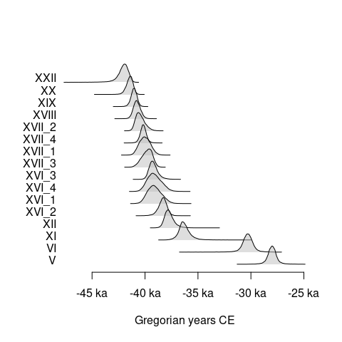
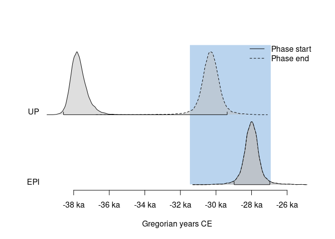

<!-- README.md is generated from README.Rmd. Please edit that file -->

# ArchaeoPhases

<!-- badges: start -->

[](https://github.com/ArchaeoStat/ArchaeoPhases/actions/workflows/R-CMD-check.yaml)
[](https://app.codecov.io/gh/ArchaeoStat/ArchaeoPhases)
[](https://cran.r-project.org/package=ArchaeoPhases)

<a href="https://ArchaeoStat.r-universe.dev/ArchaeoPhases"
class="pkgdown-devel"></a>
<a href="https://cran.r-project.org/package=ArchaeoPhases"
class="pkgdown-release"></a> <a
href="https://cran.r-project.org/web/checks/check_results_ArchaeoPhases.html"
class="pkgdown-release"></a>
<a href="https://cran.r-project.org/package=ArchaeoPhases"
class="pkgdown-release"></a>

[](https://www.repostatus.org/#active)

[](https://doi.org/10.5281/zenodo.8087121)
[](https://doi.org/10.18637/jss.v093.c01)
<!-- badges: end -->

## Overview

Statistical analysis of archaeological dates and groups of dates.
**ArchaeoPhases** allows to post-process Markov Chain Monte Carlo (MCMC)
simulations from [ChronoModel](https://chronomodel.com) (Lanos et al.
2020), [Oxcal](https://c14.arch.ox.ac.uk/oxcal.html) (Bronk Ramsey 2009)
or [BCal](https://bcal.shef.ac.uk) (Buck, Christen, and James 1999).
This package provides functions for the study of rhythms of the long
term from the posterior distribution of a series of dates (tempo and
activity plot). It also allows the estimation and visualization of time
ranges from the posterior distribution of groups of dates
(e.g. duration, transition and hiatus between successive phases).

**ArchaeoPhases v2.0 brings a comprehensive package rewrite, resulting
in the renaming of nearly all functions. For more information, please
refer to `news(Version >= "2.0", package = "ArchaeoPhases")`.**

    To cite ArchaeoPhases in publications use:

      Philippe A, Vibet M (2020). "Analysis of Archaeological Phases Using
      the R Package ArchaeoPhases." _Journal of Statistical Software, Code
      Snippets_, *93*(1). doi:10.18637/jss.v093.c01
      <https://doi.org/10.18637/jss.v093.c01>.

      Philippe A, Vibet M, Dye T, Frerebeau N (2023). _ArchaeoPhases:
      Post-Processing of Markov Chain Monte Carlo Simulations for
      Chronological Modelling_. Université de Nantes, Nantes, France.
      doi:10.5281/zenodo.8087121 <https://doi.org/10.5281/zenodo.8087121>,
      R package version 2.0,
      <https://ArchaeoStat.github.io/ArchaeoPhases/>.

## Installation

You can install the released version of **ArchaeoPhases** from
[CRAN](https://CRAN.R-project.org) with:

``` r
install.packages("ArchaeoPhases")
```

And the development version from [GitHub](https://github.com/) with:

``` r
# install.packages("remotes")
remotes::install_github("ArchaeoStat/ArchaeoPhases")
```

You can install the 1.x releases from the CRAN archives:

``` r
# install.packages("remotes")
remotes::install_version("ArchaeoPhases", version = "1.8")
```

## Usage

**ArchaeoPhases** v2.0 uses **aion** for internal date representation.
Look at `vignette("aion", package = "aion")` before you start.

These examples use data available through the
[**ArchaeoData**](https://github.com/ArchaeoStat/ArchaeoData) package
which is available in a [separate
repository](https://archaeostat.r-universe.dev). **ArchaeoData**
provides MCMC outputs from ChronoModel, OxCal and BCal.

``` r
## Install data package
install.packages("ArchaeoData", repos = "https://archaeostat.r-universe.dev")
```

``` r
## Load package
library(ArchaeoPhases)
```

Import a CSV file containing a sample from the posterior distribution:

``` r
## Read output from ChronoModel
path <- "chronomodel/ksarakil/"

## Events
path_event <- system.file(path, "Chain_all_Events.csv", package = "ArchaeoData")
(chrono_events <- read_chronomodel_events(path_event))
#> <EventsMCMC>
#> - Number of events: 16
#> - Number of MCMC samples: 30000

## Phases
path_phase <- system.file(path, "Chain_all_Phases.csv", package = "ArchaeoData")
(chrono_phases <- read_chronomodel_phases(path_phase))
#> <PhasesMCMC>
#> - Number of phases: 4
#> - Number of MCMC samples: 30000
```

### Analysis of a series of dates

``` r
## Plot the first event
plot(chrono_events[, 1], interval = "hdr")

## Plot all events
plot(chrono_events)
```



``` r
## Tempo plot
tp <- tempo(chrono_events, level = 0.95)
plot(tp)

## Activity plot
ac <- activity(chrono_events)
plot(ac)
```


### Analysis of a group of dates (phase)

``` r
bound <- boundaries(chrono_phases, level = 0.95)
as.data.frame(bound)
#>              start       end duration
#> EPI      -28978.53 -26969.82 2009.709
#> UP       -38570.37 -29368.75 9202.620
#> Ahmarian -42168.47 -37433.31 4736.161
#> IUP      -43240.37 -41161.00 2080.371
```

``` r
## Plot all phases
plot(chrono_phases)
```


``` r
plot(chrono_phases[, c("UP", "EPI"), ], succession = "hiatus")
```


``` r
plot(chrono_phases[, c("UP", "EPI"), ], succession = "transition")
```



## References

<div id="refs" class="references csl-bib-body hanging-indent"
entry-spacing="0">

<div id="ref-allen1983" class="csl-entry">

Allen, James F. 1983. “Maintaining Knowledge about Temporal Intervals.”
*Communications of the ACM* 26 (11): 832–43.
<https://doi.org/10.1145/182.358434>.

</div>

<div id="ref-bosch2015" class="csl-entry">

Bosch, Marjolein D., Marcello A. Mannino, Amy L. Prendergast, Tamsin C.
O’Connell, Beatrice Demarchi, Sheila M. Taylor, Laura Niven, Johannes
van der Plicht, and Jean-Jacques Hublin. 2015. “New Chronology for Ksâr
‘Akil (Lebanon) Supports Levantine Route of Modern Human Dispersal into
Europe.” *Proceedings of the National Academy of Sciences* 112 (25):
7683–88. <https://doi.org/10.1073/pnas.1501529112>.

</div>

<div id="ref-bronkramsey2009" class="csl-entry">

Bronk Ramsey, Christopher. 2009. “Bayesian Analysis of Radiocarbon
Dates.” *Radiocarbon* 51 (1): 337–60.
<https://doi.org/10.1017/S0033822200033865>.

</div>

<div id="ref-buck1999" class="csl-entry">

Buck, C. E., J. A. Christen, and G. E. James. 1999. “BCal: An on-Line
Bayesian Radiocarbon Calibration Tool.” *Internet Archaeology* 7.
<https://doi.org/10.11141/ia.7.1>.

</div>

<div id="ref-dye2016" class="csl-entry">

Dye, Thomas S. 2016. “Long-Term Rhythms in the Development of Hawaiian
Social Stratification.” *Journal of Archaeological Science* 71 (July):
1–9. <https://doi.org/10.1016/j.jas.2016.05.006>.

</div>

<div id="ref-dye2023" class="csl-entry">

Dye, Thomas S., Caitlin E. Buck, Robert J. DiNapoli, and Anne Philippe.
2023. “Bayesian Chronology Construction and Substance Time.” *Journal of
Archaeological Science* 153: 105765.
https://doi.org/<https://doi.org/10.1016/j.jas.2023.105765>.

</div>

<div id="ref-ghosh2020" class="csl-entry">

Ghosh, Sambit, Prasanta Sanyal, Sohom Roy, Ravi Bhushan, Sp Sati, Anne
Philippe, and Navin Juyal. 2020. “Early Holocene Indian Summer Monsoon
and Its Impact on Vegetation in the Central Himalaya: Insight from
<span class="nocase">dD</span> and d <sup>13</sup> C Values of Leaf Wax
Lipid.” *The Holocene* 30 (7): 1063–74.
<https://doi.org/10.1177/0959683620908639>.

</div>

<div id="ref-harris1997" class="csl-entry">

Harris, Edward C. 1997. *Principles of Archaeological Stratigraphy*.
Seconde édition. London: Academic Press.

</div>

<div id="ref-hyndman1996" class="csl-entry">

Hyndman, Rob J. 1996. “Computing and Graphing Highest Density Regions.”
*The American Statistician* 50 (2): 120.
<https://doi.org/10.2307/2684423>.

</div>

<div id="ref-jha2020" class="csl-entry">

Jha, Deepak Kumar, Prasanta Sanyal, and Anne Philippe. 2020.
“Multi-Proxy Evidence of Late Quaternary Climate and Vegetational
History of North-Central India: Implication for the Paleolithic to
Neolithic Phases.” *Quaternary Science Reviews* 229 (February): 106121.
<https://doi.org/10.1016/j.quascirev.2019.106121>.

</div>

<div id="ref-lanos2020" class="csl-entry">

Lanos, Ph., A. Philippe, H. Lanos, and Ph. Dufresne. 2020. “Chronomodel:
Chronological Modeling of Archaeological Data Using Bayesian
Statistics.” CNRS. <https://chronomodel.com>.

</div>

<div id="ref-lyman2017" class="csl-entry">

Lyman, R. Lee, and Michael J. O’Brien. 2017. “Sedation and Cladistics:
The Difference Between Anagenetic and Cladogenetic Evolution.” In
*Mapping Our Ancestors: Phylogenetic Approaches in Anthropology and
Prehistory*, edited by Carl P. Lipo, Michael J. O’Brien, Mark Couard,
and Stephen J. Shennan. New York: Routledge.
<https://doi.org/10.4324/9780203786376>.

</div>

<div id="ref-philippe2020" class="csl-entry">

Philippe, Anne, and Marie-Anne Vibet. 2020. “Analysis of Archaeological
Phases Using the R Package ArchaeoPhases.” *Journal of Statistical
Software* 93. <https://doi.org/10.18637/jss.v093.c01>.

</div>

<div id="ref-robert2010" class="csl-entry">

Robert, Christian P., and George Casella. 2010. *Introducing Monte Carlo
Methods with R*. Use R! New York: Springer.

</div>

<div id="ref-viola2020" class="csl-entry">

Viola, Tullio. 2020. *Peirce on the Uses of History*. De Gruyter.
<https://doi.org/10.1515/9783110651560>.

</div>

</div>
