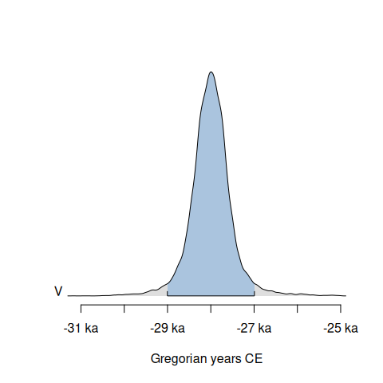
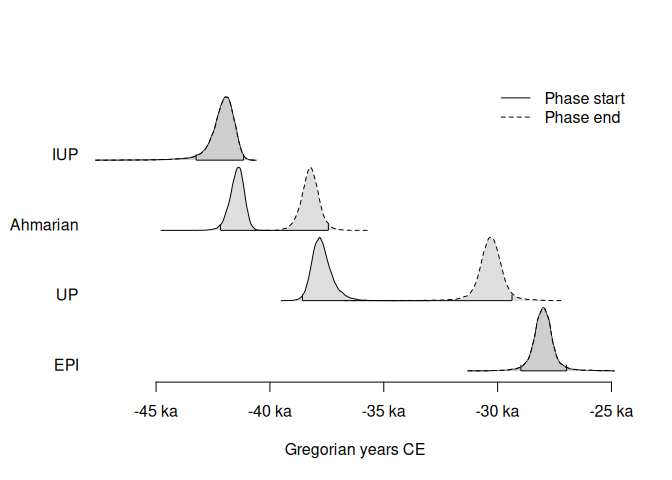

<!-- README.md is generated from README.Rmd. Please edit that file -->

# chronos 

<!-- badges: start -->

[](https://github.com/tesselle/chronos/actions)
[](https://app.codecov.io/gh/tesselle/chronos)
[](https://www.codefactor.io/repository/github/tesselle/chronos/overview/master)

<a href="https://tesselle.r-universe.dev" class="pkgdown-devel"></a>

[](https://www.repostatus.org/#active)

[](https://doi.org/10.18637/jss.v093.c01)
<!-- badges: end -->

***chronos* is a heavily modified fork of
[*ArchaeoPhases*](https://github.com/ArchaeoStat/ArchaeoPhases) v1.5,
see the changelog for details.**

## Overview

Statistical analysis of archaeological dates and groups of dates.
**chronos** allows to post-process Markov Chain Monte Carlo (MCMC)
simulations from [ChronoModel](https://chronomodel.com),
[Oxcal](https://c14.arch.ox.ac.uk/oxcal.html) or
[BCal](https://bcal.shef.ac.uk). This package provides functions for the
study of rhythms of the long term from the posterior distribution of a
series of dates (tempo and activity plot). It also allows the estimation
and visualization of time ranges from the posterior distribution of
groups of dates (e.g. duration, transition and hiatus between successive
phases).


    To cite chronos in publications use:

      Philippe, Anne & Vibet, Marie-Anne (2020). Analysis of Archaeological
      Phases Using the R Package ArchaeoPhases. Journal of Statistical
      Software, Code Snippets, 93(1), 1--25. DOI 10.18637/jss.v093.c01.

    Une entrée BibTeX pour les utilisateurs LaTeX est

      @Article{,
        title = {Analysis of Archaeological Phases Using the {R} Package {ArchaeoPhases}},
        author = {Anne Philippe and Marie-Anne Vibet},
        year = {2020},
        journal = {Journal of Statistical Software, Code Snippets},
        volume = {93},
        number = {1},
        page = {1--25},
        doi = {10.18637/jss.v093.c01},
      }

## Installation

You can install the released version of **chronos** from
[CRAN](https://CRAN.R-project.org) with:

``` r
install.packages("chronos")
```

And the development version from [GitHub](https://github.com/) with:

``` r
# install.packages("remotes")
remotes::install_github("tesselle/chronos")
```

## Usage

These examples use data available through the
[**fasti**](https://packages.tesselle.org/fasti/) package which is
available in a separate [repository](https://tesselle.r-universe.dev).
**fasti** provides MCMC outputs from ChronoModel, OxCal and BCal.

``` r
## Install the latest version
install.packages("fasti", repos = "https://tesselle.r-universe.dev")
```

``` r
## Load packages
library(chronos)
```

Import a CSV file containing a sample from the posterior distribution:

``` r
## Read output from ChronoModel
path <- "chronomodel/ksarakil/"

## Events
path_events <- system.file(path, "Chain_all_Events.csv", package = "fasti")
(chrono_events <- read_chronomodel_events(path_events))
#> <EventsMCMC>
#> - Number of events: 16
#> - Calendar: CE

## Phases
path_phases <- system.file(path, "Chain_all_Phases.csv", package = "fasti")
(chrono_phases <- read_chronomodel_phases(path_phases))
#> <PhasesMCMC>
#> - Modelled phases: EPI UP Ahmarian IUP
#> - Calendar: CE
```

**chronos** uses [**ggplot2**](https://github.com/tidyverse/ggplot2) for
plotting information. This makes it easy to customize diagrams
(e.g. using themes and scales).

### Analysis of a series of dates

``` r
## Plot the first event
plot(chrono_events, select = 1, interval = "hpdi")

## Plot all events
plot(chrono_events)
#> Picking joint bandwidth of 49.2
```



``` r
## Tempo plot
tp <- tempo(chrono_events, level = 0.95)
plot(tp)

## Activity plot
ac <- activity(chrono_events)
plot(ac)
```


### Analysis of a group of dates (phase)

``` r
boundaries(chrono_phases, level = 0.95)
#>           start    end
#> EPI      -28979 -26970
#> UP       -38570 -29369
#> Ahmarian -42168 -37433
#> IUP      -43240 -41161
```

``` r
plot(chrono_phases)
```



``` r
## Set chronological order
## (from the oldest to the youngest phase)
set_order(chrono_phases) <- c("IUP", "Ahmarian", "UP", "EPI")
get_order(chrono_phases)
#> [1] "IUP"      "Ahmarian" "UP"       "EPI"
```

``` r
plot(chrono_phases, level = 0.95)
```


