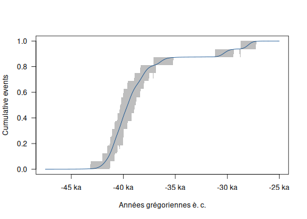
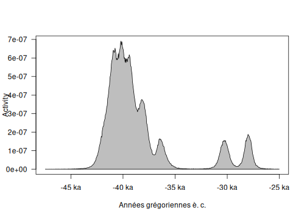
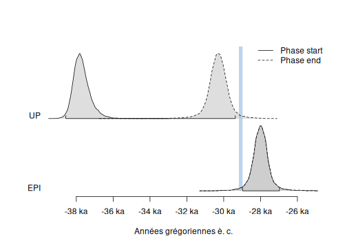

# Introduction

**ArchaeoPhases** provides a list of functions for the statistical analysis of archaeological dates and groups of dates. It is based on the post-processing of the Markov Chains whose stationary distribution is the posterior distribution of a series of dates. Such MCMC output can be simulated by different applications as for instance [ChronoModel](https://chronomodel.com/) [@lanos2020], [Oxcal](https://c14.arch.ox.ac.uk/oxcal.html) [@bronkramsey2009] or [BCal](https://bcal.shef.ac.uk/) [@buck1999]. The only requirement is to have a CSV file containing a sample from the posterior distribution.


```r
## Load packages
library(ArchaeoPhases)
library(coda) # MCMC diagnostic
```

# Import data

This vignette uses data available through the [**ArchaeoData**](https://github.com/ArchaeoStat/ArchaeoData) package which is available in a [separate repository](https://archaeostat.r-universe.dev). **ArchaeoData** provides MCMC outputs from ChronoModel, OxCal and BCal.


```r
## Install data package
install.packages("ArchaeoData", repos = "https://archaeostat.r-universe.dev")
```

Let's use the data of Ksar Akil generated by ChronoModel [@bosch2015].

Two different files are generated by ChronoModel: `Chain_all_Events.csv` that contains the MCMC samples of each event created in the modeling, and `Chain_all_Phases.csv` that contains all the MCMC samples of the minimum and the maximum of each group of dates if at least one group is created.


```r
chrono_path <- "chronomodel/ksarakil"

## Read events from ChronoModel
output_events <- system.file(chrono_path, "Chain_all_Events.csv", package = "ArchaeoData")
chrono_events <- read_chronomodel_events(output_events)

## Read phases from ChronoModel
output_phases <- system.file(chrono_path, "Chain_all_Phases.csv", package = "ArchaeoData")
chrono_phases <- read_chronomodel_phases(output_phases)
```

See `vignette("import")` for more details on how to import MCMC samples.

# Convergence of MCMC chains

For more details on the diagnostic of Markov chain, see @robert2010.

To assess the agreement between the posterior distributions and the numerical approximations, three Markov chains were run in parallel by ChronoModel. For each chain, 1 000 iterations were used during the Burn-in period, 20 batches of 500 iterations were used in the Adapt period, 100 000 iterations were drawn in the Acquire period by only 1 out of 10 were kept in order to break the correlation structure.

From the analysis of the history plot, all Markov chains reach their equilibrium before the Acquire period. The autocorrelations of the  three Markov chains are not significant, meaning the rate of subsample (1 over 10) is enough.

Now, using the package **ArchaeoPhases** and the package **coda**, we can verify whether the MCMC samples are correctly generated by the software.


```r
## Create an mcmc.list
coda_events <- as_coda(chrono_events, chains = 3)
```


Indeed, the MCMC samples should have no autocorrelation and should have reached their equilibrium (that is the posterior density of the parameter under investigation).


```r
coda::autocorr.plot(coda_events[[1]])
```

<div class="figure">

<p class="caption">plot of chunk coda-autocor</p>
</div><div class="figure">

<p class="caption">plot of chunk coda-autocor</p>
</div>

The autocorrelation plots show that each of these three chains are not significant. That means that we actually generated a non correlated sample, which was the aim the MCMC process.

We can also check whether the chains reached equilibrium. For example, let's consider the first date of the dataset.


```r
plot(coda_events[, 1, ], trace = TRUE, density = FALSE)
```

<div class="figure">

<p class="caption">plot of chunk coda-plot</p>
</div>

The plot shows that the three chains corresponding to the first date reached the same stationary process.

We can test the Gelman-Rubin criterion. The expected value to confirm that all of the Markov chains reached equilibrium is 1.


```r
coda::gelman.diag(coda_events)
#> Potential scale reduction factors:
#> 
#>       Point est. Upper C.I.
#>  [1,]          1          1
#>  [2,]          1          1
#>  [3,]          1          1
#>  [4,]          1          1
#>  [5,]          1          1
#>  [6,]          1          1
#>  [7,]          1          1
#>  [8,]          1          1
#>  [9,]          1          1
#> [10,]          1          1
#> [11,]          1          1
#> [12,]          1          1
#> [13,]          1          1
#> [14,]          1          1
#> [15,]          1          1
#> [16,]          1          1
#> 
#> Multivariate psrf
#> 
#> 1
```

The Gelman-Rubin criterion confirms that all of the Markov chains reached equilibrium.

We can also test the Geweke criterion. The expected value to confirm that all of the Markov chains reached equilibrium is strickly less than 1.


```r
coda::geweke.diag(coda_events[, 1, ], frac1 = 0.1, frac2 = 0.5)
#> [[1]]
#> 
#> Fraction in 1st window = 0.1
#> Fraction in 2nd window = 0.5 
#> 
#>   var1 
#> 0.4978 
#> 
#> 
#> [[2]]
#> 
#> Fraction in 1st window = 0.1
#> Fraction in 2nd window = 0.5 
#> 
#>   var1 
#> 0.7736 
#> 
#> 
#> [[3]]
#> 
#> Fraction in 1st window = 0.1
#> Fraction in 2nd window = 0.5 
#> 
#>   var1 
#> 0.7666
```

The Geweke criterion criterion confirms that all of the Markov chains reached equilibrium.

ChronoModel generated correct samples of the posterior distribution. Now gathering the three chains, a total of 30 000 iterations was collected in order to give estimations of the posterior distribution of each parameter.

# Analysis of a series of dates


```r
plot(chrono_events)
```

<div class="figure">

<p class="caption">plot of chunk event-plot</p>
</div>

## Tempo Plot
The tempo plot has been introduced by @dye2016. See @philippe2020 for more statistical details.

The tempo plot is one way to measure change over time: it estimates the cumulative occurrence of archaeological events in a Bayesian calibration. The tempo plot yields a graphic where the slope of the plot directly reflects the pace of change: a period of rapid change yields a steep slope and a period of slow change yields a gentle slope. When there is no change, the plot is horizontal. When change is instantaneous, the plot is vertical.


```r
## Warning: this may take a few seconds
tp <- tempo(chrono_events, level = 0.95, count = FALSE)
plot(tp)
```

<div class="figure">

<p class="caption">plot of chunk tempo-plot</p>
</div>

From these graphs, we can see that the highest part of the sampled activity is dated between -45 000 to -35 000 but two dates are younger, at about -32 000 and -28 000.

## Activity Plot
The activity plot displays the derivative of the Bayes estimate of the Tempo plot. It is an other way to see changes over time.


```r
## Warning: this may take a few seconds
ac <- activity(tp)
plot(ac)
```

<div class="figure">

<p class="caption">plot of chunk activity-plot</p>
</div>

## Occurrence Plot
The Occurrence plot calculates the calendar date $t$ corresponding to the smallest date such that the number of events observed before $t$ is equal to $k$, for $k = [(1, 16)]$. The Occurrence plot draws the credible intervals or the highest posterior density (HPD) region of those dates associated to a desired level of confidence.


```r
## Warning: this may take a few seconds
oc <- occurrence(chrono_events, level = 0.95)
plot(oc)
```

<div class="figure">

<p class="caption">plot of chunk occurrence-plot</p>
</div>

# Analysis of groups of dates
## Groups of dates

A group of dates (phase) is defined by the date of the minimum and the date of the maximum of the group. In this part, we will use the data containing these values for each group of dates.


```r
## Build phases from events
p <- list(EPI = 1, UP = 2:4, Ahmarian = 5:15, IUP = 16)
chrono_groups <- phases(chrono_events, groups = p)

all(chrono_groups == chrono_phases)
#> [1] TRUE
```

We can estimate the time range of a group of dates as the shortest interval that contains all the dates of the group at a given confidence level [@philippe2020].

The following code gives the endpoints of the time range of all groups of dates of Ksar Akil data at a given confidence level.


```r
bound <- boundaries(chrono_groups, level = 0.95)
as.data.frame(bound)
#>              start       end duration
#> EPI      -28978.53 -26969.82 2009.709
#> UP       -38570.37 -29368.75 9202.620
#> Ahmarian -42168.47 -37433.31 4736.161
#> IUP      -43240.37 -41161.00 2080.371
```

The time range interval of the group of dates is a way to summarize the estimation of its minimum, the estimation of its maximum and their uncertainties at the same time.


```r
plot(chrono_groups, level = 0.95)
```

<div class="figure">

<p class="caption">plot of chunk phases-plot</p>
</div>

## Succession of groups

We may also be interested in a succession of phases. This is actually the case of the succession of *IUP*, *Ahmarian*, *UP* and *EPI* that are in stratigraphic order. Hence, we can estimate the transition interval and, if it exists, the gap between these successive phases.

### Transistions between successive groups

The transition interval between two successive phases is the shortest interval that covers the end of the oldest group of dates and the start of the youngest group of dates. The start and the end are estimated by the minimum and the maximum of the dates included in the group of dates. It gives an idea of the transition period between two successive group of dates. From a computational point of view this is equivalent to the time range calculated between the end of the oldest group of dates and the start of the youngest group of dates.


```r
trans <- transition(chrono_groups, level = 0.95)
as.data.frame(trans)
#>                  start       end  duration
#> UP-EPI       -31479.79 -26905.04  4575.756
#> Ahmarian-EPI -39138.82 -27122.05 12017.766
#> IUP-EPI      -43487.53 -26866.99 16621.537
#> Ahmarian-UP  -39118.07 -36741.08  2377.983
#> IUP-UP       -43395.89 -36480.26  6916.631
#> IUP-Ahmarian -43212.31 -40733.77  2479.539
```

### Gap between successive groups

Successive phases may also be separated in time. Indeed there may exist a gap between them. This testing procedure check whether a gap exists between two successive groups of dates with fixed probability. If a gap exists, it is an interval that covers the end of one group of dates and the start of the successive one with fixed posterior probability.


```r
hia <- hiatus(chrono_groups, level = 0.95)
as.data.frame(hia)
#>                  start       end   duration
#> UP-EPI       -29188.56 -28961.79   227.7663
#> Ahmarian-EPI -37368.33 -28884.37  8484.9583
#> IUP-EPI      -41220.64 -28814.70 12406.9352
#> IUP-UP       -41282.64 -38421.49  2862.1447
```

At a confidence level of 95%, there is no gap between the succession of phases *IUP*, *Ahmarian* and *UP*, but there exists one of 203 years between phase *UP* and phase *EPI*.


```r
plot(chrono_groups[, c("UP", "EPI"), ], succession = "hiatus", level = 0.95)
```

<div class="figure">

<p class="caption">plot of chunk succession-plot</p>
</div>

# References
