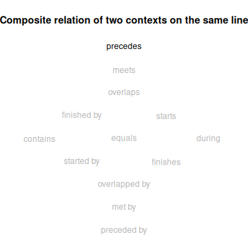
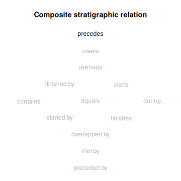
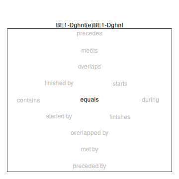
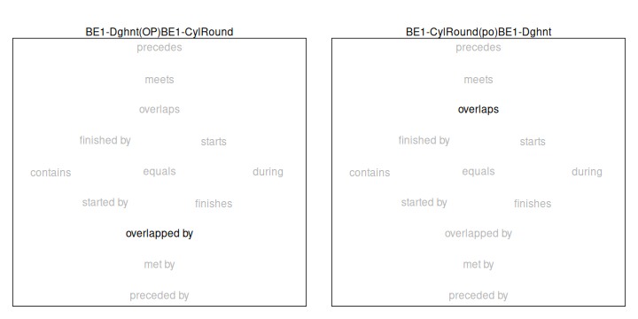

**ArchaeoPhases** provides facilities to compute Allen's interval algebra. This vignette provides an overview of the algebra and illustrates how it might be used analytically and empirically, given MCMC output from a Bayesian calibration.


``` r
## Load ArchaeoPhases
library(ArchaeoPhases)
```

This vignette uses data available through the [**ArchaeoData**](https://github.com/ArchaeoStat/ArchaeoData) package which is available in a [separate repository](https://archaeostat.r-universe.dev). **ArchaeoData** provides MCMC outputs from ChronoModel, OxCal and BCal.


``` r
## Install data package
install.packages("ArchaeoData", repos = "https://archaeostat.r-universe.dev")
```

# Overview of Allen's Interval Algebra

Allen's interval algebra identifies 13 basic relations that are distinct, exhaustive, and qualitative [@allen1983]. The algebra is defined for definite intervals whose endpoints are single values. It can also be used with indefinite intervals whose endpoints are not single values.

It is conventional to express an Allen relation with a notation that indicates two intervals and a set of relations. For example, given definite intervals *A* and *B*, where *A* precedes *B*, their Allen relation can be represented as *A(p)B*. Given indefinite intervals *C* and *D*, where *C* starts before *D* starts and ends before *D* ends, an Allen relation that expresses this incomplete information is *C(pmo)D*. Note that the Allen set (pmo) in the relation of *C* and *D* is a superset of the Allen set (p) in the relation of *A* and *B*. In this circumstance, when two Allen sets are related as superset/subset, the relation indicated by the superset is *weaker* and the relation indicated by the subset is *stronger*. An Allen relation thus provides a precise vocabulary for characterizing the state of knowledge about the relation between two intervals, regardless of whether the intervals are definite or indefinite.

| **Relation** |     |     |  **Converse** |
|:-------------|:---:|:---:|--------------:|
| precedes     | (p) | (P) |   preceded by |
| meets        | (m) | (M) |        met by |
| overlaps     | (o) | (O) | overlapped by |
| finished by  | (F) | (f) |      finishes |
| contains     | (D) | (d) |        during |
| starts       | (s) | (S) |    started by |
| equals       | (e) |     |               |


It is often useful to visualize the basic Allen relations as a Nökel lattice. In a Nökel lattice, the immediate neighbors of a relation differ from it in the placement of a single interval end-point.


``` r
## Plot the basic Allen relations
par(mar = c(1, 1, 4, 1))
allen_illustrate("basic")
```

<div class="figure" style="text-align: center">

<p class="caption">plot of chunk basic_relations</p>
</div>


# Analytic Inquiry with the Algebra

Interval algebra is carried out with a composition function that returns the relation of two intervals given their relations to a common third interval. As implemented here, the function expects the relation of one interval to the common interval and the relation of the common interval to the remaining interval. The function also accepts a title for the resulting Nokel lattice.

In this example, the composition function deduces that the interval represented by a context inferior to a reference context precedes the interval represented by a context superior to the reference context.


``` r
## Plot lattice for two contexts on the same line of a Harris matrix
par(mar = c(1, 1, 4, 1))
allen_analyze(
  x = "m",
  y = "m",
  main = "Composite relation of two contexts on the same line"
)
```

<div class="figure" style="text-align: center">

<p class="caption">plot of chunk analyze_stratigraphy</p>
</div>

The same lattice can be created with a convenience function.


``` r
## Illustrate composite relations in a stratigraphic sequence
par(mar = c(1, 1, 4, 1))
allen_illustrate("sequence")
```

<div class="figure" style="text-align: center">

<p class="caption">plot of chunk illustrate_stratigraphy</p>
</div>

# Empirical Inquiry with the Algebra

Empirical inquiry with Allen's interval algebra compares intervals estimated by Bayesian calibration of age determinations from Anglo-Saxon female burials.


``` r
## Load the Anglo Saxon burials dataset
path <- system.file("oxcal", "burials.csv", package = "ArchaeoData")
burials <- read.table(path, header = TRUE, sep = ",", dec = ".",
                      check.names = FALSE)

## Coerce to event
burials <- as_events(burials, calendar = CE())
```

First, we check for the expected result of the identity relation by comparing an interval with itself.


``` r
## Identify the burials with bead BE1-Dghnt
be1_dghnt <- c(
  "UB-4503 (Lec148)", "UB-4506 (Lec172/2)", "UB-6038 (CasD183)",
  "UB-4512 (EH091)", "UB-4501 (Lec014)", "UB-4507 (Lec187)",
  "UB-4502 (Lec138)", "UB-4042 (But1674)", "SUERC-39100 (ERL G266)"
)

## Build phases
chains <- list("BE1-Dghnt" = be1_dghnt)
be1_dghnt_phase <- phases(burials, groups = chains)

## Plot
par(mar = c(1, 1, 4, 1))
allen_observe(be1_dghnt_phase)
```

<div class="figure" style="text-align: center">

<p class="caption">plot of chunk identity_relation</p>
</div>

Next we compare the depositional histories of two bead types recovered from well-dated Anglo Saxon female burials in England.
Note that the Allen relation and its converse are calculated.


``` r
## Identify the burials with bead BE1-CylRound
be1_cylround <- c(
  "UB-4965 (ApD117)", "UB-4735 (Ber022)", "UB-4739 (Ber134/1)",
  "UB-6473 (BuD250)", "UB-6476 (BuD339)", "UB-4729 (MH068)",
  "UB-4835 (ApD134)", "UB-4708 (EH083)", "UB-4733 (MH095)",
  "UB-4888 (MelSG089)", "UB-4963 (SPTip208)", "UB-4890 (MelSG075)",
  "UB-4732 (MH094)", "SUERC-51539 (ERL G353)", "SUERC-51551 (ERL G193)"
)

## Build phases
chains <- list("BE1-Dghnt" = be1_dghnt, "BE1-CylRound" = be1_cylround)
be1_phase <- phases(burials, groups = chains)

## Plot phase
par(mar = c(4, 6, 1, 1))
plot(be1_phase)
```

<div class="figure" style="text-align: center">

<p class="caption">plot of chunk phases</p>
</div>


``` r
## Plot relations
par(mar = c(1, 1, 4, 1))
allen_observe(be1_phase, converse = TRUE)
```

<div class="figure" style="text-align: center">

<p class="caption">plot of chunk relation_and_converse</p>
</div>

It can be useful to observe the frequency with which two intervals are related according to the relations in an Allen set. For instance, we might be interested in which of our two beads might be the trunk from which the other branched. This can be done by observing the frequency with which each bead type is related as *row(oFD)col* to the other bead. The following code shows that BE1-CylRound is the better trunk candidate.


``` r
allen_observe_frequency(be1_phase, set = "oFD")
#>              BE1-Dghnt BE1-CylRound
#> BE1-Dghnt           NA            0
#> BE1-CylRound    0.9962           NA
```

# References
