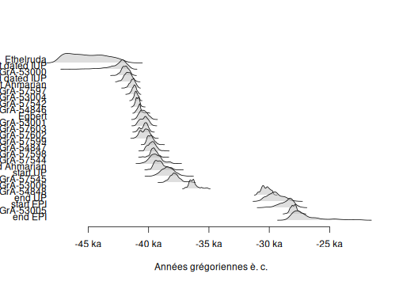
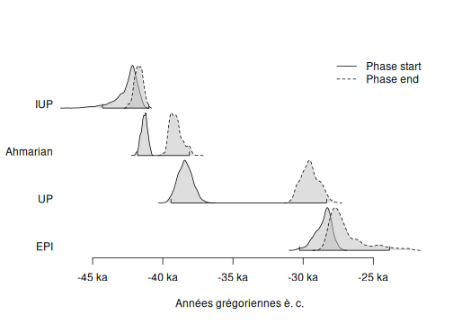
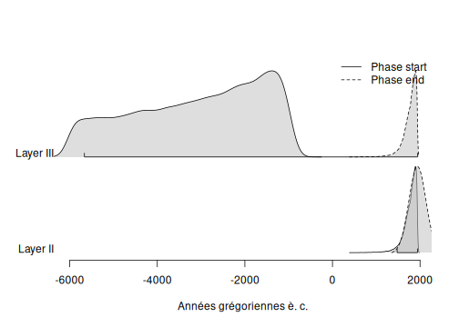

This vignette uses data available through the [**ArchaeoData**](https://github.com/ArchaeoStat/ArchaeoData) package which is available in a [separate repository](https://archaeostat.r-universe.dev). **ArchaeoData** provides MCMC outputs from ChronoModel, OxCal and BCal.


```r
## Install data package
install.packages("ArchaeoData", repos = "https://archaeostat.r-universe.dev")
```


```r
## Load package
library(ArchaeoPhases)
```

# ChronoModel

Two different files are generated by ChronoModel: `Chain_all_Events.csv` that contains the MCMC samples of each event created in the modeling, and `Chain_all_Phases.csv` that contains all the MCMC samples of the minimum and the maximum of each group of dates if at least one group is created.


```r
## Read events from ChronoModel
output_events <- system.file("chronomodel/ksarakil/Chain_all_Events.csv",
                             package = "ArchaeoData")
chrono_events <- read_chronomodel_events(output_events)

## Plot events
plot(chrono_events)
```


```r
## Read phases from ChronoModel
output_phases <- system.file("chronomodel/ksarakil/Chain_all_Phases.csv",
                             package = "ArchaeoData")
chrono_phases <- read_chronomodel_phases(output_phases)

## Plot phases
plot(chrono_phases)
```


# Oxcal

Oxcal generates a CSV file containing the MCMC samples of all parameters (dates, start and end of phases).


```r
## Read OxCal MCMC samples
output_oxcal <- system.file("oxcal/ksarakil/MCMC_Sample.csv",
                            package = "ArchaeoData")
oxcal_mcmc <- read_oxcal(output_oxcal)

## Plot events
plot(oxcal_mcmc)
```



The phase boundaries cannot be extracted automatically from Oxcal output. Use `as_phases()` to get the phase boundaries:


```r
## Get phases boundaries from OxCal
oxcal_phases <- as_phases(oxcal_mcmc,
                          start = c(2, 5, 19, 24),
                          stop = c(4, 18, 23, 26),
                          names = c("IUP", "Ahmarian", "UP", "EPI"))

## Plot phase boundaries
plot(oxcal_phases)
```



# BCal

BCal generates a CSV file containing the MCMC samples of all parameters (dates, start and end of groups).


```r
## Read BCal MCMC samples
output_bcal <- system.file("bcal/fishpond.csv", package = "ArchaeoData")
bcal_mcmc <- read_bcal(output_bcal)
```

The group boundaries cannot be extracted automatically from BCal output. Use `as_phases()` to get the group boundaries:


```r
## Get groups boundaries from BCal
bcal_phases <- as_phases(
  bcal_mcmc,
  start = c(6, 9),
  stop = c(1, 7),
  names = c("Layer II", "Layer III")
)

## Plot group boundaries
plot(bcal_phases)
```


