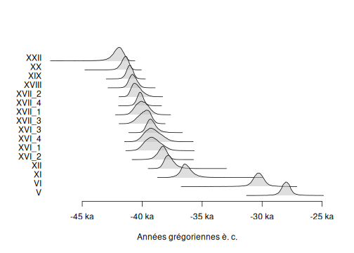

This vignette uses data available through the [**ArchaeoData**](https://github.com/ArchaeoStat/ArchaeoData) package which is available in a [separate repository](https://archaeostat.r-universe.dev). **ArchaeoData** provides MCMC outputs from ChronoModel, OxCal and BCal.


``` r
## Install data package
install.packages("ArchaeoData", repos = "https://archaeostat.r-universe.dev")
```


``` r
## Load package
library(ArchaeoPhases)
```

# ChronoModel

Two different files are generated by ChronoModel: `Chain_all_Events.csv` that contains the MCMC samples of each event created in the modeling, and `Chain_all_Phases.csv` that contains all the MCMC samples of the minimum and the maximum of each group of dates if at least one group is created.


``` r
## Construct the path to the data
path_events <- file.path("chronomodel", "ksarakil", "Chain_all_Events.csv")
output_events <- system.file(path_events, package = "ArchaeoData")

## Read events from ChronoModel
chrono_events <- read_chronomodel_events(output_events)

## Plot events
plot(chrono_events)
```

<div class="figure">

<p class="caption">plot of chunk read-chronomodel-events</p>
</div>


``` r
## Construct the path to the data
path_phases <- file.path("chronomodel", "ksarakil", "Chain_all_Phases.csv")
output_phases <- system.file(path_phases, package = "ArchaeoData")

## Read phases from ChronoModel
chrono_phases <- read_chronomodel_phases(output_phases)

## Plot phases
plot(chrono_phases)
```

<div class="figure">

<p class="caption">plot of chunk read-chronomodel-phases</p>
</div>

# Oxcal

Oxcal generates a CSV file containing the MCMC samples of all parameters (dates, start and end of phases).


``` r
## Construct the path to the data
path_oxcal <- file.path("oxcal", "ksarakil", "MCMC_Sample.csv")
output_oxcal <- system.file(path_oxcal, package = "ArchaeoData")

## Read OxCal MCMC samples
oxcal_mcmc <- read_oxcal(output_oxcal)

## Plot events
plot(oxcal_mcmc)
```

<div class="figure">

<p class="caption">plot of chunk read-oxcal</p>
</div>

The phase boundaries cannot be extracted automatically from Oxcal output. Use `as_phases()` to get the phase boundaries:


``` r
## Get phases boundaries from OxCal
oxcal_phases <- phases(
  x = oxcal_mcmc,
  groups = list(IUP = c(2, 4), Ahmarian = c(5, 18),
                UP = c(19, 23), EPI = c(24, 26))
)

## Plot phase boundaries
plot(oxcal_phases)
```

<div class="figure">

<p class="caption">plot of chunk oxcal-phases</p>
</div>

# BCal

BCal generates a CSV file containing the MCMC samples of all parameters (dates, start and end of groups).


``` r
## Construct the path to the data
path_bcal <- file.path("bcal", "fishpond.csv")
output_bcal <- system.file(path_bcal, package = "ArchaeoData")

## Read BCal MCMC samples
bcal_mcmc <- read_bcal(output_bcal)
```

The group boundaries cannot be extracted automatically from BCal output. Use `as_phases()` to get the group boundaries:


``` r
## Get groups boundaries from BCal
bcal_phases <- phases(
  x = bcal_mcmc,
  groups = list(`Layer II` = c(6, 1), `Layer III` = c(9, 7))
)

## Plot group boundaries
plot(bcal_phases)
```

<div class="figure">

<p class="caption">plot of chunk bcal-phases</p>
</div>
