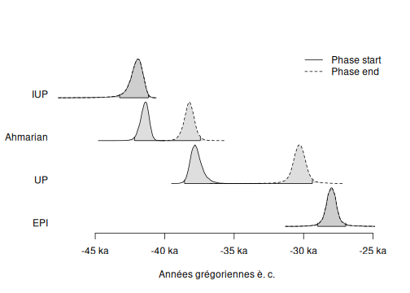

This vignette uses data available through the [**fasti**](https://packages.tesselle.org/fasti/) package which is available in a separate [repository](https://tesselle.r-universe.dev). **fasti** provides MCMC outputs from ChronoModel, OxCal and BCal.


```r
## Install the latest version
install.packages("fasti", repos = "https://tesselle.r-universe.dev")
```


```r
library(chronos)
```

## ChronoModel

Two different files are generated by ChronoModel: `Chain_all_Events.csv` that contains the MCMC samples of each event created in the modeling, and `Chain_all_Phases.csv` that contains all the MCMC samples of the minimum and the maximum of each group of dates if at least one group is created.


```r
## Read events from ChronoModel
output_events <- system.file("chronomodel/ksarakil/Chain_all_Events.csv",
                             package = "fasti")
chrono_events <- read_chronomodel_events(output_events)

## Plot events
plot(chrono_events)
#> Picking joint bandwidth of 49.2
```


```r
## Read phases from ChronoModel
output_phases <- system.file("chronomodel/ksarakil/Chain_all_Phases.csv",
                             package = "fasti")
chrono_phases <- read_chronomodel_phases(output_phases)

## Plot phases
set_order(chrono_phases) <- c("IUP", "Ahmarian", "UP", "EPI")
plot(chrono_phases, succession = FALSE)
```



## Oxcal

Oxcal generates a CSV file containing the MCMC samples of all parameters (dates, start and end of phases).


```r
## Read OxCal MCMC samples
output_oxcal <- system.file("oxcal/ksarakil/MCMC_Sample.csv", package = "fasti")
oxcal_mcmc <- read_oxcal(output_oxcal)
```

The phase boundaries cannot be extracted automatically from Oxcal output. Use `as_phases()` to get the phase boundaries:


```r
## Get phases boundaries from OxCal
oxcal_phases <- as_phases(oxcal_mcmc,
                          start = c(2, 5, 19, 24),
                          stop = c(4, 18, 23, 26),
                          names = c("IUP", "Ahmarian", "UP", "EPI"),
                          ordered = TRUE)

## Plot phase boundaries
plot(oxcal_phases, succession = FALSE)
```


```r
## Computes phases boundaries (min-max)
groups <- list(IUP = 3, Ahmarian = c(6:12, 14:17), UP = 20:22, EPI = 25)
oxcal_groups <- phase(oxcal_mcmc, groups = groups, ordered = TRUE)

## Plot phases boundaries
plot(oxcal_groups, succession = FALSE)
```


## BCal

BCal generates a CSV file containing the MCMC samples of all parameters (dates, start and end of groups).


```r
## Read BCal MCMC samples
output_bcal <- system.file("bcal/output/rawmcmc.csv", package = "fasti")
bcal_mcmc <- read_bcal(output_bcal)
```

The group boundaries cannot be extracted automatically from BCal output. Use `as_phases()` to get the group boundaries:


```r
## Get groups boundaries from BCal
bcal_phases <- as_phases(bcal_mcmc,
                         start = c(1, 4, 9, 22),
                         stop = c(3, 8, 21, 24),
                         names = c("EPI", "UP", "Ahmarian", "IUP"))

## Plot group boundaries
set_order(bcal_phases) <- c("IUP", "Ahmarian", "UP", "EPI")
plot(bcal_phases, succession = FALSE)
```


```r
## Compute phase boundaries (min-max)
groups <- list(IUP = 23, Ahmarian = 10:20, UP = 5:7, EPI = 2)
bcal_groups <- phase(bcal_mcmc, groups = groups, ordered = TRUE)

## Plot phase boundaries
plot(bcal_groups, succession = FALSE)
```


